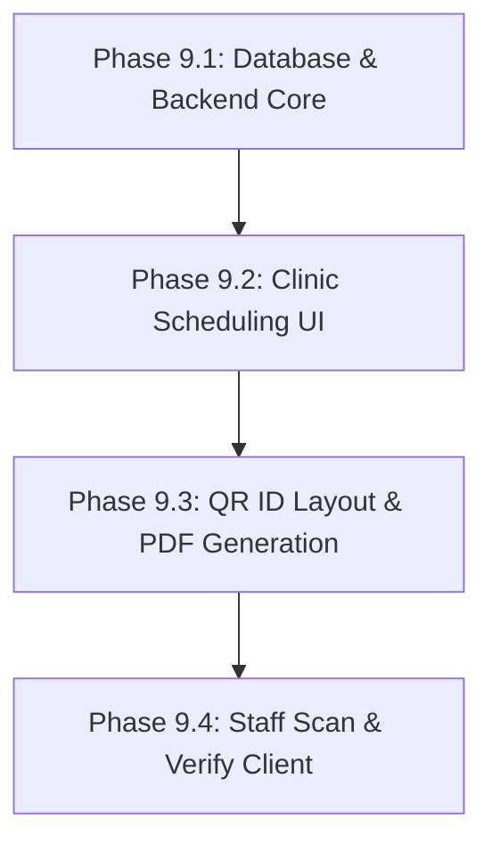

# 📋 Baesys — Phase 9 Implementation Plan: Health Clinic Scheduling & Digital Barangay ID

This document outlines the detailed technical design, database schema updates, backend API paths, and frontend views required to implement **Health Clinic & Facility Appointment Scheduling** and the **Digital Barangay ID & Mobile Pass** in the Baesys Barangay System.

---

## 🗄️ 1. Database Schema Changes

We will introduce a database migration (`014_phase9_clinic_and_digital_id.sql`) to define the new tables and table updates.

```sql
-- A. HEALTH CLINIC TABLES

-- Clinic Services (e.g. Pediatric Consultation, Dental Checkup, Free Vaccination)
CREATE TABLE clinic_services (
    id INT AUTO_INCREMENT PRIMARY KEY,
    name VARCHAR(100) NOT NULL,
    description TEXT,
    estimated_duration_mins INT DEFAULT 30,
    is_active TINYINT(1) DEFAULT 1,
    created_at TIMESTAMP DEFAULT CURRENT_TIMESTAMP
);

-- Clinic Schedules / Slots (Set up by Admin/Staff)
CREATE TABLE clinic_schedules (
    id INT AUTO_INCREMENT PRIMARY KEY,
    service_id INT NOT NULL,
    schedule_date DATE NOT NULL,
    start_time TIME NOT NULL,
    end_time TIME NOT NULL,
    max_slots INT DEFAULT 10,
    filled_slots INT DEFAULT 0,
    created_at TIMESTAMP DEFAULT CURRENT_TIMESTAMP,
    FOREIGN KEY (service_id) REFERENCES clinic_services(id) ON DELETE CASCADE
);

-- Appointments (Booked by Residents)
CREATE TABLE appointments (
    id INT AUTO_INCREMENT PRIMARY KEY,
    resident_id INT NOT NULL,
    service_id INT NOT NULL,
    schedule_id INT NOT NULL,
    appointment_time TIME NOT NULL,
    purpose TEXT,
    status ENUM('pending', 'approved', 'cancelled', 'completed') DEFAULT 'pending',
    staff_notes TEXT,
    created_at TIMESTAMP DEFAULT CURRENT_TIMESTAMP,
    updated_at TIMESTAMP DEFAULT CURRENT_TIMESTAMP ON UPDATE CURRENT_TIMESTAMP,
    FOREIGN KEY (resident_id) REFERENCES residents(id) ON DELETE CASCADE,
    FOREIGN KEY (service_id) REFERENCES clinic_services(id) ON DELETE CASCADE,
    FOREIGN KEY (schedule_id) REFERENCES clinic_schedules(id) ON DELETE CASCADE
);

-- B. RESIDENTS TABLE UPDATES (For Digital ID Verification)
ALTER TABLE residents 
ADD COLUMN barangay_id_no VARCHAR(50) UNIQUE DEFAULT NULL,
ADD COLUMN digital_id_issued_at DATE DEFAULT NULL,
ADD COLUMN digital_id_expires_at DATE DEFAULT NULL,
ADD COLUMN digital_id_secure_hash VARCHAR(64) DEFAULT NULL;
```

---

## 🩺 2. Health Clinic Scheduling Feature

### A. Backend API Endpoints (`/backend/api/clinic/`)
1. **`services.php` (GET / POST / PUT)**:
   - `GET`: Retrieve list of active services (e.g., vaccination, pre-natal, consultation).
   - `POST` / `PUT` (Staff only): Create and update available services.
2. **`schedules.php` (GET / POST)**:
   - `GET`: Fetch dates and time slots with capacity tracking.
   - `POST` (Staff only): Generate bulk daily slots for a particular service.
3. **`book.php` (POST)**:
   - Create a resident clinic appointment booking.
   - Ensure the selected slot has available capacity (`filled_slots < max_slots`).
4. **`appointments.php` (GET / PUT)**:
   - `GET` (Resident): Fetch resident's own booking history.
   - `GET` (Staff/Admin): Fetch daily scheduler board (filterable by date, status, service).
   - `PUT` (Staff/Admin): Update appointment status (`approved`, `cancelled`, `completed`).

### B. Frontend Views & Components
1. **Resident Portal**:
   - **`ClinicBooking.jsx`**: A step-by-step scheduler wizard.
     1. Choose a service.
     2. Choose a date (visual calendar showing slots).
     3. Select an available time slot.
     4. Input the booking reason and confirm.
   - **`MyAppointments.jsx`**: History table showing upcoming bookings, ticket details, and a cancel button.
2. **Admin Portal**:
   - **`ClinicDashboard.jsx`**: A grid calendar overview highlighting total bookings per day.
   - **`AppointmentsManager.jsx`**: Check-in dashboard showing today's patient queue, enabling staff to add notes and update status to "Completed".
   - **`SchedulesConfig.jsx`**: Form to configure service hours, slot limits, and doctor availability.

---

## 🪪 3. Digital Barangay ID & Mobile Pass

### A. Backend API Endpoints (`/backend/api/digital-id/`)
1. **`generate.php` (POST)**:
   - Staff only. Approves a resident's request for a Digital ID.
   - Computes a unique `barangay_id_no` (e.g., `BAESA-2026-0001`) and generates a secure verification SHA-256 hash containing ID details to prevent forgery.
2. **`get-id-details.php` (GET)**:
   - Fetches ID metadata, QR Code content, and barcode values.
   - Generates a QR Code encoding the verification URL (e.g., `http://baesys.local/verify-id?hash=...`).
3. **`download-card.php` (GET)**:
   - Generates a wallet-sized physical ID card PDF using mPDF, complete with signature fields, dry seal graphics, and a QR verification code.
4. **`scan-verify.php` (GET/POST)**:
   - Accepts scanned ID hashes and returns the resident's verified information (live status check) to detect fake or expired passes.

### B. Frontend Views & Components
1. **Resident Portal**:
   - **`DigitalID.jsx`**: A sleek card interface.
     - Front features: Profile photo, resident name, ID number, and expiration date.
     - Back features: Barcode/QR Code, emergency contact info, and home address.
     - Includes a button to download the printable PDF card.
2. **Admin Portal / Checkpoint**:
   - **`IDScanner.jsx`**: Camera check-in view using the `html5-qrcode` library.
     - Staff points the camera at a resident's phone.
     - Scans the QR Code, verifies status through `/scan-verify.php`, and registers attendance for relief distribution or events.

---

## 🚀 4. Sequential Phases of Implementation



### Phase 9.1 — Database Setup & API Foundations
* Setup the database tables and modify the residents structure.
* Build the service and scheduling endpoints.
* Implement SHA-256 verification hash generators.

### Phase 9.2 — Clinic Scheduling Portal (Resident & Admin)
* Build the calendar bookings wizard on the Resident side.
* Implement queue logs and schedule configuration managers on the Admin side.

### Phase 9.3 — Digital ID Rendering & PDF Exports
* Embed local QR code generation scripts.
* Code the front/back CSS wallet layout for the Resident profile view.
* Style the PDF generator export.

### Phase 9.4 — Staff Scan & Check-in System
* Build the camera scanner portal.
* Integrate scanner verification API testing to flag spoofed or revoked IDs.
